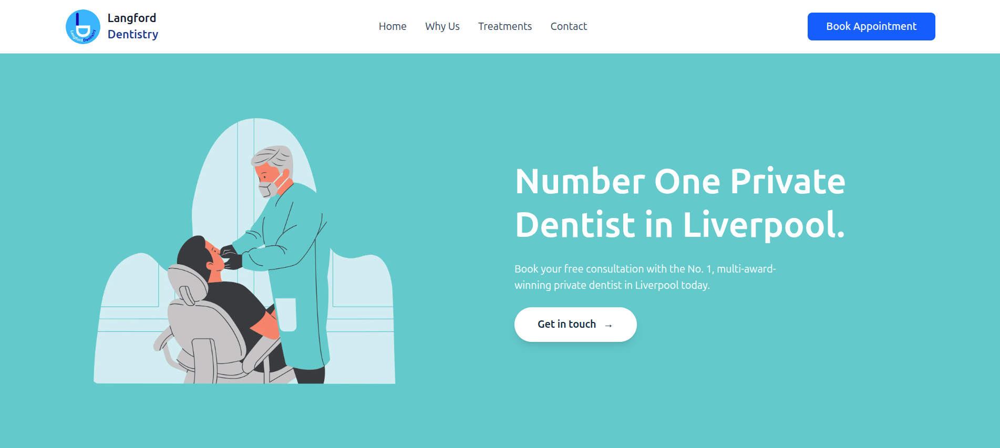

# 🦷 Langford Dentistry — Modern Private Dental Clinic Web App

A fully responsive, production-grade dental clinic website built with **Next.js (App Router)**, **Tailwind CSS**, and **ShadCN UI**.  
Langford Dentistry showcases treatments, bookings, clinic information, and a premium brand identity — deployed seamlessly on **Vercel** for global performance.

---

---

## ✨ Features

- **🏥 Modern Clinic Homepage** — Hero section, services, testimonials, and gallery  
- **🦷 Treatments Overview** — Categorized cosmetic, orthodontic, general & restorative treatments  
- **📄 Individual Treatment Pages** — Detailed pages for Invisalign, Whitening, Veneers, Implants & more  
- **📅 Online Booking System** — Patient form submission with Resend email notifications  
- **📨 Contact Page** — Google Maps embed + working contact form  
- **🎨 Premium UI & Animations** — Framer Motion-powered hero animations  
- **🌐 Fully Responsive UI** — Polished mobile & desktop layouts  
- **⚡ Lightning-Fast Hosting** — Deployed on Vercel with global CDN + SSL  

---

## 🧠 Tech Stack

### Frontend
- Next.js (App Router)  
- React  
- Tailwind CSS  
- ShadCN UI  
- Framer Motion  

### Backend (API Routes)
- Next.js Server Actions  
- Resend API (email delivery for bookings & contact form)

### Deployment
- Vercel  
- Git & GitHub  
- Environment Variables (Resend API keys)

---

## 📁 Folder Structure

langford-dentistry-clinic-webapp/
│
├── app/ # Next.js app router pages
│ ├── api/ # API routes for booking & contact forms
│ ├── book/ # Online booking page
│ ├── contact/ # Contact form + map
│ ├── treatments/ # Treatment categories + individual pages
│ ├── why-us/ # Why Choose Us page
│ ├── layout.tsx # Global layout + Navbar + Footer
│ └── page.tsx # Homepage
│
├── components/ # Reusable UI components
│ ├── Navbar.tsx
│ ├── Footer.tsx
│ └── TreatmentTemplate.tsx
│
├── public/ # Images, icons, and static assets
│
├── styles/ # Global CSS (Tailwind)
│
├── package.json
└── tsconfig.json

yaml
Copy code

---

## 🚀 Installation & Setup (Local Development)

### 1️⃣ Clone the repository

git clone https://github.com/YOUR_USERNAME/langford-dentistry-clinic-webapp.git
cd langford-dentistry-clinic-webapp

yaml
Copy code

---

### 2️⃣ Install dependencies

npm install

yaml
Copy code

---

### 3️⃣ Setup environment variables

Create `.env.local` in the root:

RESEND_API_KEY=your_resend_key
RESEND_FROM_EMAIL=your_email@domain.com
NEXT_PUBLIC_SITE_URL=http://localhost:3000

yaml
Copy code

---

### 4️⃣ Run development server

npm run dev

makefile
Copy code

Visit:

http://localhost:3000

yaml
Copy code

---

## 🚀 Production Deployment (Vercel)

1. Push your project to GitHub  
2. Go to **Vercel → New Project**  
3. Import the repository  
4. Add environment variables:

RESEND_API_KEY=your_resend_key
RESEND_FROM_EMAIL=your_email
NEXT_PUBLIC_SITE_URL=https://your-domain.com

yaml
Copy code

5. Click **Deploy**  
6. Connect your custom domain (optional)  
7. Vercel automatically:  
   - Builds app  
   - Sets up SSL  
   - Deploys CDN globally  

Your live version is instantly available.

---

## 🧪 API Endpoints

### Send Contact Form  
**POST /api/contact**

Body:
name
email
message

yaml
Copy code

---

### Book an Appointment  
**POST /api/book**

Body:
name
email
phone
treatment
date
time
notes (optional)

yaml
Copy code

Both routes send emails via **Resend API**.

---

## 📌 Future Improvements

- Admin dashboard to manage bookings  
- Prisma + PostgreSQL database storage  
- Appointment calendar system  
- Blog for SEO  
- Social media integrations  
- Cookie banner + privacy policy  
- AI chatbot for patient FAQs  

---

## ❤️ Acknowledgements

This project demonstrates modern **Next.js development**, real-world UI/UX design, animations, email-based bookings, and production deployment using Vercel — delivering a polished, premium experience suitable for high-end businesses.
